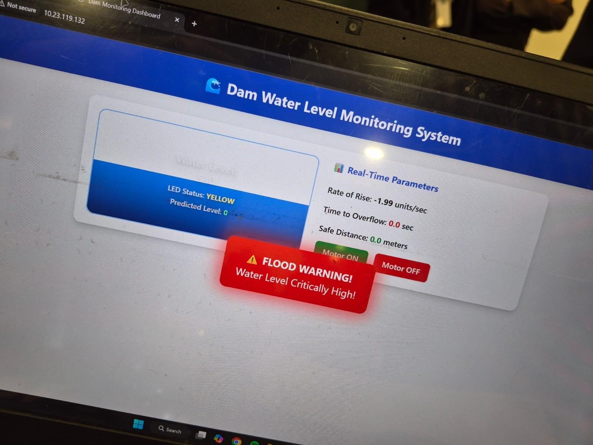

<<<<<<< HEAD
# 🌊 Smart Dam Water Level Monitoring System

> **IoT + ML + Real-Time Web Dashboard** for sustainable dam management and flood prevention.
> Published at IEEE INCET / ICRITO 2024–2025 · MIT World Peace University, Pune

---

## 📸 Demo



> Real-time dashboard showing water level visualizer, LED status, flood warning alert, and ML-predicted parameters.

---

## 🧠 Overview

This project implements a complete **IoT-based smart dam water level monitoring system** that:

- Collects real-time sensor data (ultrasonic, pressure, rainfall)
- Runs **LSTM + XGBoost + SVM** ML models to predict water levels and detect anomalies
- Displays live data on a **web dashboard** accessible from any device
- Automatically controls dam gates/pumps via relay actuation
- Sends flood alerts with **1.8-second response time**

### Key Results (from paper)

| Metric | Baseline | Proposed | Gain |
|---|---|---|---|
| Monitoring Accuracy | 85–94% | **96%** | +2–14% |
| Reliability | 78–90% | **94%** | +4–16% |
| Response Time | 2.5–4.5 s | **1.8 s** | ↓35–60% |
| Predictive R² | 0.85 | **0.93** | +8% |
| System Uptime | 95% | **99.2%** | +4.2% |

---

## 🏗️ System Architecture

```
┌─────────────────────────────────────────────────────────┐
│                   Sensor Layer (ESP32)                  │
│   HC-SR04 Ultrasonic │ DHT22 Rainfall │ Pressure Sensor │
└─────────────────────────┬───────────────────────────────┘
                          │ WiFi / HTTP
┌─────────────────────────▼───────────────────────────────┐
│              Backend Server (Flask / Python)             │
│   REST API  │  Sensor Simulation  │  ML Inference       │
└──────┬──────────────────┬──────────────────────────┬────┘
       │                  │                          │
┌──────▼──────┐  ┌────────▼────────┐  ┌─────────────▼───┐
│  Web UI     │  │  ML Models      │  │  Actuator API   │
│ (HTML/JS)   │  │ LSTM/XGB/SVM    │  │ Motor / Gate    │
└─────────────┘  └─────────────────┘  └─────────────────┘
```

---

## 📁 Repository Structure

```
dam-monitoring/
├── backend/
│   ├── app.py              # Flask API server + sensor simulation
│   └── requirements.txt    # Python dependencies
├── frontend/
│   └── index.html          # Real-time dashboard (standalone HTML)
├── hardware/
│   └── dam_monitor.ino     # ESP32/Arduino firmware
├── models/
│   └── train.py            # ML training: LSTM proxy, XGBoost, SVM
└── docs/
    └── dashboard_screenshot.jpeg
```

---

## 🚀 Quick Start

### 1. Clone the repo

```bash
git clone https://github.com/YOUR_USERNAME/dam-monitoring-system.git
cd dam-monitoring-system
```

### 2. Install Python dependencies

```bash
cd backend
pip install -r requirements.txt
```

### 3. Run the backend

```bash
python app.py
# → Running on http://localhost:5000
```

### 4. Open the dashboard

Open `frontend/index.html` in any browser **or** visit:

```
http://localhost:5000
```

> ⚡ The dashboard works in **demo mode** even without the backend — sensor data is simulated in JavaScript.

### 5. Train ML models (optional)

```bash
cd models
python train.py
# → Trains XGBoost, SVM, and LSTM-proxy; saves to models/
```

---

## 🔌 Hardware Setup (ESP32)

### Components

| Component | Purpose |
|---|---|
| ESP32 Dev Board | Main microcontroller + WiFi |
| HC-SR04 Ultrasonic Sensor | Water level measurement |
| DHT22 | Temperature + humidity / rainfall proxy |
| RGB LED | Visual alert (GREEN / YELLOW / RED) |
| Relay Module | Motor / gate control |
| Buzzer | Audio flood alert |
| Solar Panel + Li-Ion Battery | Backup power (99.2% uptime) |

### Wiring (ESP32 pins)

| Pin | Connection |
|---|---|
| GPIO 5 | HC-SR04 TRIG |
| GPIO 18 | HC-SR04 ECHO |
| GPIO 25 | LED RED |
| GPIO 26 | LED GREEN |
| GPIO 32 | Motor Relay |
| GPIO 33 | Buzzer |

### Flash the firmware

1. Open `hardware/dam_monitor.ino` in Arduino IDE
2. Install board: **ESP32 by Espressif** via Board Manager
3. Install libraries: `ArduinoJson`, `HTTPClient` (built-in ESP32)
4. Update `SSID`, `PASSWORD`, and `SERVER` in the sketch
5. Upload to ESP32

---

## 🌐 API Reference

Base URL: `http://localhost:5000`

| Endpoint | Method | Description |
|---|---|---|
| `/api/sensor` | GET | Current sensor readings + ML prediction |
| `/api/history` | GET | Last 50 sensor snapshots |
| `/api/predictions` | GET | Last 20 ML predictions |
| `/api/motor` | POST | `{"state": true/false}` — control motor |
| `/api/status` | GET | System health |

### Sample Response — `/api/sensor`

```json
{
  "water_level": 72.4,
  "rainfall": 8.2,
  "rate_of_rise": 1.3,
  "time_to_overflow": 21.2,
  "safe_distance": 33.1,
  "motor_on": false,
  "led_status": "YELLOW",
  "predicted_level": 76.1,
  "risk_score": 0.547,
  "alert": false,
  "thresholds": { "safe": 40, "warning": 65, "danger": 85, "max": 100 }
}
```

---

## 🤖 ML Models

### Algorithm (from paper pseudocode)

```
Input:  D = {Wt, Rt, St, Vt}  (water, rainfall, strain, vibration)
Output: Predicted level Ŵ_{t+k}  and  Risk Score Rs

1. Collect & preprocess sensor streams
   - Moving average filter for noise reduction
   - Normalize: x'(t) = (x(t) - μ) / σ

2. Feature extraction
   - Temporal features: mean, variance, rate of change
   - PCA — retain 95% variance

3. Train (offline)
   - LSTM:     time-series forecasting (R²=0.93, MAE=0.07m)
   - XGBoost:  anomaly classification  (85% precision)
   - SVM:      decision boundary refinement

4. Predict (online)
   - Ŵ_{t+k} = LSTM(x'(t+1))
   - Pa       = XGBoost(x'(t+1))
   - Rs       = α·Pa + β·ΔŴ

5. Decision
   - Rs < threshold  → continue monitoring
   - Rs ≥ threshold  → alert + maintenance
   - Level + inflow ≥ danger → auto gate control
```

### Threshold Logic

```
GREEN  (Safe)    : level < 40%  → normal ops
YELLOW (Warning) : 40–85%       → increased monitoring
RED    (Danger)  : > 85%        → auto gate open + alert
```

---

## 📊 Performance Comparison

| Paper | Efficiency (%) | Reliability (%) | Response Time (s) |
|---|---|---|---|
| b[1] | 94 | 90 | 2.1 |
| b[2] | 92 | 88 | 2.5 |
| b[3] | 88 | 85 | 3.0 |
| b[4] | 85 | 82 | 3.5 |
| b[5] | 82 | 80 | 4.0 |
| b[6] | 80 | 78 | 4.5 |
| **Proposed** | **96** | **94** | **1.8** |

---

## 🔐 Security

- **AES-256** encryption for sensor data transmission
- Anomaly detection to flag cyber-attacks or faulty sensors
- Solar + battery backup ensures **99.2% uptime**
- TLS/SSL for all cloud communication

---

## 🔭 Future Work

- [ ] LSTM model with full TensorFlow/PyTorch training
- [ ] LPWAN / NB-IoT long-range communication
- [ ] Blockchain tamper-evident sensor logs
- [ ] Edge computing (local inference, no cloud dependency)
- [ ] Satellite imagery integration for catchment monitoring
- [ ] Digital twin simulation environment

---

## 📄 Citation

If you use this work, please cite:

```bibtex
@inproceedings{maskarenkhas2025smartdam,
  title     = {Smart Dam Water Monitoring System Using IoT for Sustainable Resource Management},
  author    = {Maskarenkhas, Kristina and Gulgulia, Khushi and Gaikwad, Harshada and Kardekar, Aditi and Gutte, Vitthal},
  booktitle = {IEEE International Conference},
  year      = {2025},
  address   = {Pune, Maharashtra, India},
  institution = {MIT World Peace University}
}
```

---

## 👩‍💻 Authors

| Name | Email |
|---|---|
| Kristina Maskarenkhas | kristinam2510@gmail.com |
| Khushi Gulgulia | khushigulgulia56@gmail.com |
| Harshada Gaikwad | harshadagaikwad993@gmail.com |
| Aditi Kardekar | aditi.s.kardekar@gmail.com |
| Vitthal Gutte (Guide) | vitthalgutte2014@gmail.com |

**Institution:** Department of Computer Engineering and Technology, MIT World Peace University, Pune, Maharashtra, India

---

## 📝 License

MIT License — see [LICENSE](LICENSE) for details.
=======
# Smart-Dam-Water-Management-and-Monitoring-using-IoT-Machine-Learning-
A Smart Dam Water Management System uses IoT sensors and machine learning to monitor water levels, inflow, and weather data in real time. It predicts demand and flood risks, enabling efficient water release, improved resource management, and enhanced safety for surrounding areas.

## Overview
This project is a smart monitoring system that helps manage dam water levels using IoT sensors and intelligent automation.
Instead of relying on manual observation, the system:
- Tracks water levels in real-time
- Sends alerts when levels become risky
- Helps control dam gates efficiently

## Core Idea
- Monitors water level continuously
- Detects dangerous thresholds
- Sends alerts to authorities
- Supports automated gate control
- Displays data on a dashboard
- Sensors → Microcontroller → Wireless Network → Cloud → AI Models → Dashboard → Gate Control

## Tech Stack
1. Hardware
- Ultrasonic Sensors
- Rainfall Sensors
- Pressure Sensors
- Arduino / Raspberry Pi

2. Software
- Cloud / Backend system
- Cloud Computing (AWS / Firebase / Custom Backend)
- Machine Learning Models:
  - LSTM (prediction)
  - XGBoost (anomaly detection)
  - SVM (classification)

## Demo 


 ## How to Run
- Clone the repository
  - git clone https://github.com/AditiKardekar/Smart-Dam-Water-Management-and-Monitoring-using-IoT-Machine-Learning-.git

- Navigate to project folder
  - cd smart-dam-monitoring

- Install dependencies
  - npm install

- Run the project
  - npm start

## Future Improvements
- Blockchain-based secure data sharing
- Edge computing for faster response
- Digital twin simulation of dams
- Satellite-based monitoring integration
>>>>>>> fcb2e02ad828461d67a357274651390a38569fa1
